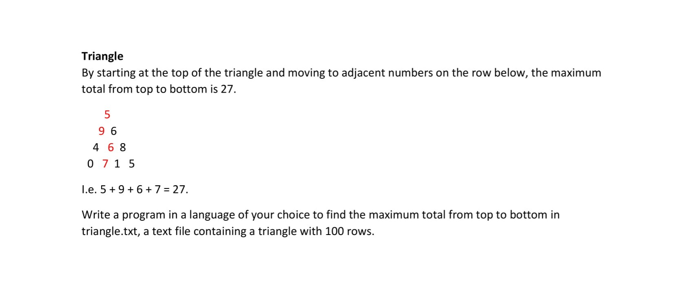

# Triangle Challenge Assignment
This is an assignment with a programmatic challenge for JobTarget

## Challenge description


## Proposed solution

### Approach

In order to find a maximum value, values can be added from bottom to top, replacing the upper line with the sum of the respective value and its higer adjacent from the line below. This helps to evalute the different possibilities and trying always to maximize the result. This calculation can be started with a backwards loop through the different lines of the triangle and the maximum value will be eventually calculated when the loop reaches the top of the triangle (i.e. line 1).

### Loop for solution

After the data is cleaned from the txt file, the values in a line can be stored in lists and the whole triangle can be represented in a nested list, where every line is another list of values. This will be easier to work with when creating a loop. 

```
triangle = [ [1], [1, 2], [1, 2, 3], ... [1, 2, 3, ... 100] ]
```

This type of nested loop was created to iterate backwards in the triangle lines and continously storing the sum of the higher value with its adjacent value from the line above. 
```
for i in reversed(range(100)):
    j = len(triangle[i])
    for j in reversed(range(j)):
        if triangle[i][j] > triangle[i][j-1]:
            triangle[i-1][j-1] += triangle[i][j]
        else:
            triangle[i-1][j-1] += triangle[i][j-1]
```

The maximum value would be then calculated on top of the triangle that can be accessed simply by using the respective index:

```
solution = triangle[0][0]
```

## Solution

The code resulted in a max value of: 

***7,663,834,210,484,951,096,731,044,858,154,745***

when the code was run in Python. 

## Important Recommendations

In order to use this code, please use Python 3 or a higher version. 

The code can be run using the command line:

```
python3 challenge.py
```
and the result will be printed in the console

